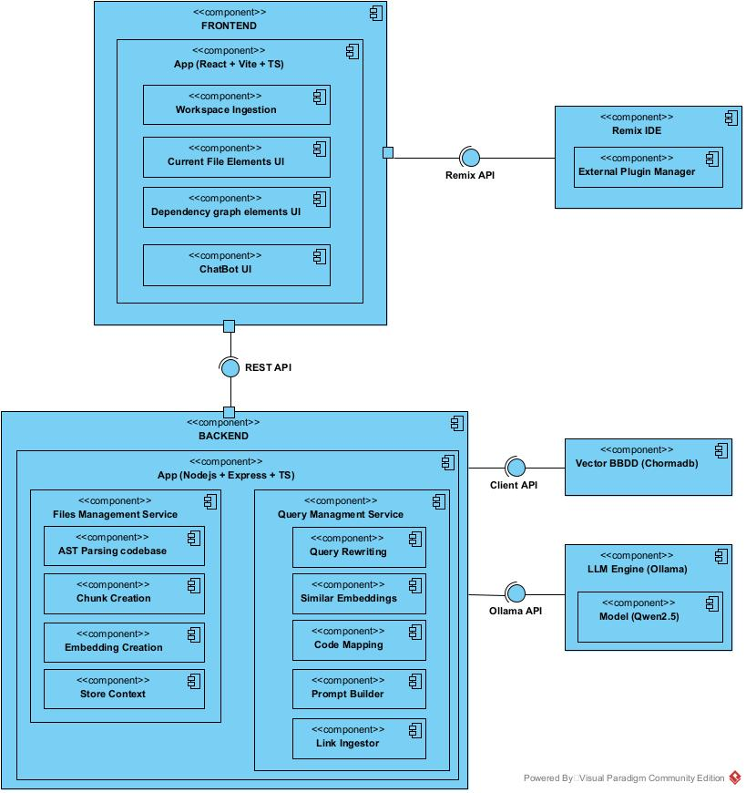

# remix-solidity-assistant

This project provides an AI-powered assistant designed as a plugin for the Remix IDE. Its primary purpose is to help developers analyze, audit, and understand Solidity codebases, supporting both single-file and cross-file analysis.

> [!NOTE]
> This project is functional, but several implementations are still in active development and may not always produce the expected outputs. Use it at your own risk.

---

## Technical Documentation

For deep dives into specific subsystems, please refer to their respective documentation:

* [**Frontend (Remix Plugin)**](./docs/frontend/README.md) – User interface, conversational chatbot, and integration with the Remix IDE API.
* [**Backend (RAG Engine)**](./docs/backend/README.md) – Core AI assistant powered by AST-based structural chunking pipelines, ChromaDB vector storage, and offline Ollama orchestration.

---

## System Architecture

* **Frontend:** React + Vite + TypeScript
* **Backend:** Node.js + Express + TypeScript
* **Vector Database:** ChromaDB
* **LLM Engine:** Ollama (Local)




---

## Quick Start & Installation

### 1. Clone and Launch the Stack

```bash
git clone https://github.com/angel-software/remix-solidity-assistant.git
cd remix-solidity-assistant
docker compose up --build
```

### 2. Register the Plugin in Remix IDE

1. Open **Remix IDE**.
2. In the left panel, click on the **Plugin Manager** (plug icon).
3. Select **"Connect to an external plugin"**.
4. Configure the following settings:
   * **Plugin Name:** `Solidity AI Assistant` (or your preferred name)
   * **URL:** `http://localhost:3000/` (Default local frontend port)
   * **Type:** `iframe`
   * **Location:** `side panel`
5. Click **Minimize/Activate** to start using the plugin.

### 3. Environment & Hardware Optimization

A `.env` file is located in the root directory to customize ports and configurations.

> [!NOTE]
> The `.env` file controls model selection. If your hardware permits, upgrading the default models is highly recommended to maximize analysis accuracy and reasoning depth.

| Configuration | Default Model (Lightweight) | Recommended Model (High Performance) |
| :--- | :--- | :--- |
| **LLM Engine (`OLLAMA_MODEL`)** | `qwen2.5-coder:1.5b-instruct` | `qwen2.5-coder:7b-instruct` |
| **Embeddings (`EMBEDDING_MODEL`)** | `Xenova/bge-small-en-v1.5` | `Xenova/bge-large-en-v1.5` |

---

## Performance & Latency Benchmarks

Expected operational times depend heavily on your hardware configuration and project scale:

* **Initial Setup (`docker compose`)**: ~30 minutes *(Includes downloading base Docker images and heavy model weights)*.
* **Project Ingestion & Indexing**: ~12 seconds to 1.5 minutes *(Scales with repository size and codebase complexity)*.
* **Inference Response (Q&A)**: 15 to 45 seconds *(Depends on prompt complexity, context window size, and model parameters)*.
